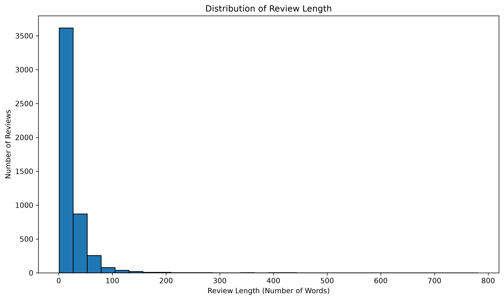
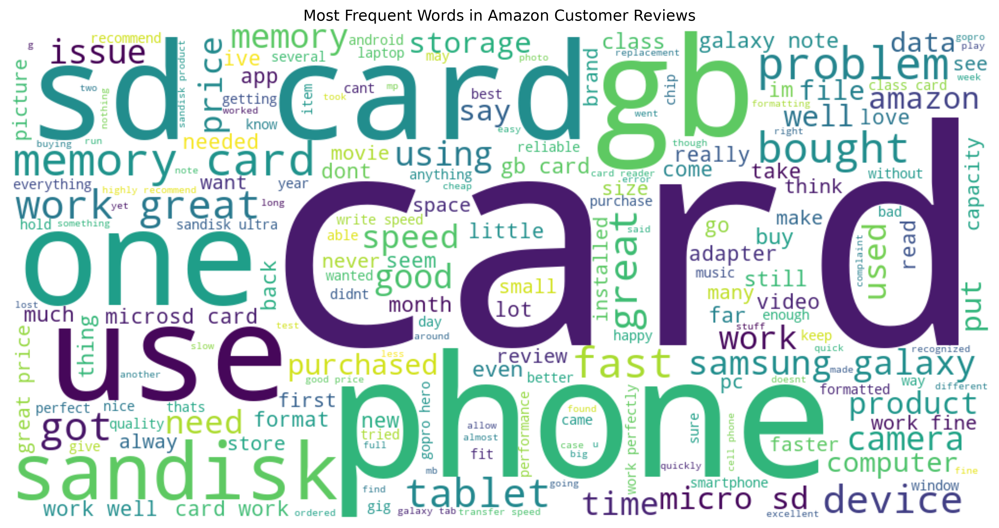
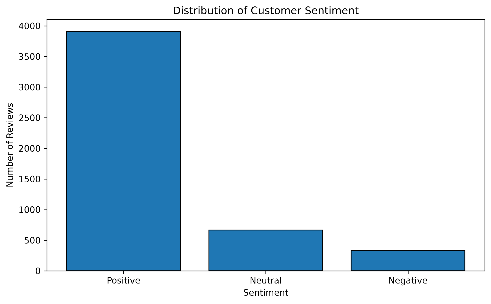
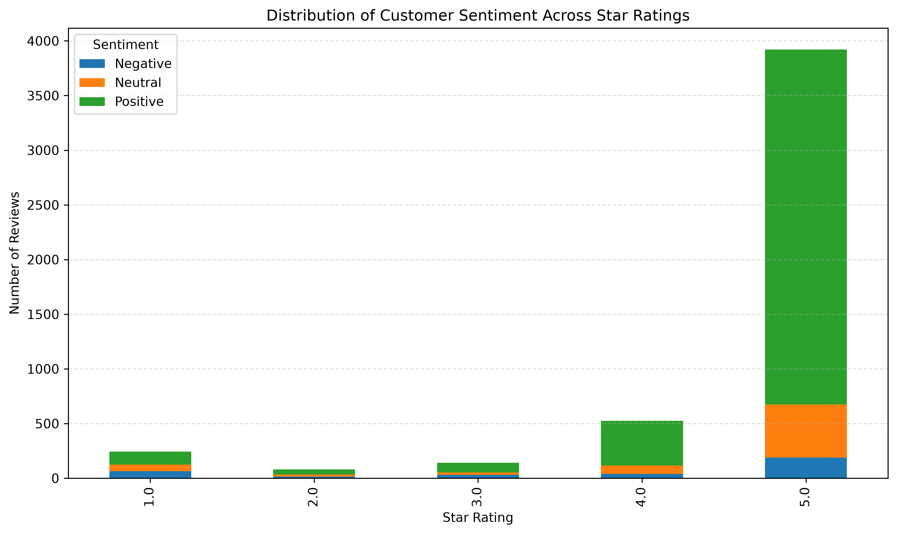
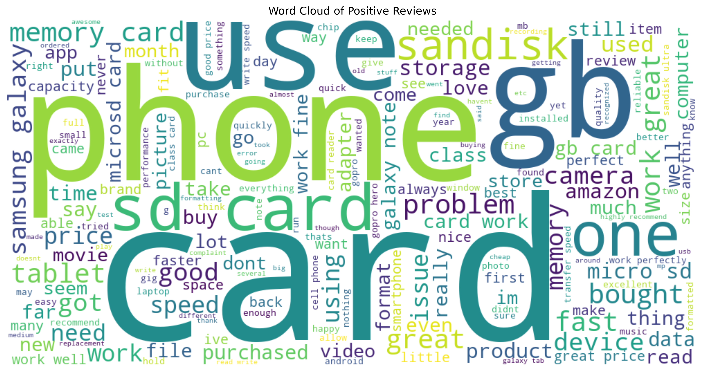
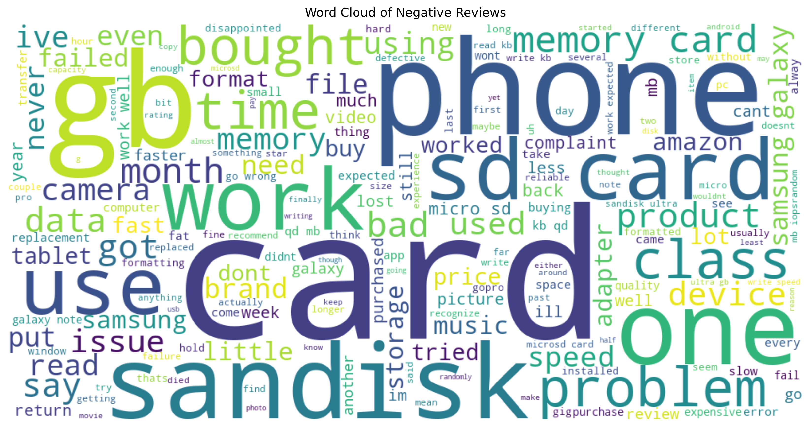

# 🧠 Amazon Customer Review Analytics

### Exploratory Text Analysis (ETA) & Sentiment Analysis using Natural Language Processing (NLP)

> **An end-to-end NLP project demonstrating how customer reviews can be transformed into actionable business insights using Exploratory Text Analysis and Sentiment Analysis.**

---

## 📌 Project Overview

This project applies **Natural Language Processing (NLP)** and **Data Analytics** techniques to analyze Amazon customer reviews and transform unstructured textual feedback into actionable business insights.

The project follows an end-to-end analytics workflow that includes data understanding, data cleaning, NLP preprocessing, Exploratory Text Analysis (ETA), Sentiment Analysis, Business Insights, and Strategic Recommendations.

Instead of relying only on product ratings, the analysis explores customer review text to understand customer opinions, identify recurring product features, measure customer satisfaction, and support evidence-based business decision-making.

---

# 🎯 Business Problem

E-commerce platforms receive thousands of customer reviews every day. While numerical ratings provide a general indication of customer satisfaction, they do not explain **why customers are satisfied or dissatisfied**.

Manually analyzing large volumes of textual reviews is time-consuming and often impractical.

This project addresses that challenge by applying Natural Language Processing (NLP) techniques to automatically analyze customer reviews, identify sentiment, discover recurring discussion themes, and generate actionable business insights that support product improvement and customer-centric decision-making.

---

# 🎯 Project Objectives

The primary objective of this project is to transform unstructured Amazon customer reviews into meaningful business intelligence using Natural Language Processing (NLP).

Specifically, the project aims to:

- Analyze customer opinions expressed in textual reviews.
- Perform Exploratory Text Analysis (ETA) to identify frequently discussed topics.
- Measure customer sentiment using TextBlob sentiment analysis.
- Discover product strengths and recurring customer concerns.
- Generate business insights supported by analytical evidence.
- Provide strategic recommendations to improve customer satisfaction and product performance.

---

## 📂 Dataset Information

The project uses an Amazon customer review dataset containing both structured and unstructured information.

Each row represents one customer review and includes reviewer details, written feedback, star ratings, review dates, and helpfulness-related metrics.

### Dataset Summary

| Attribute | Details |
|---|---|
| Dataset Name | Amazon Customer Reviews Dataset |
| Original Records | 4,915 |
| Cleaned Records | 4,913 |
| Number of Features | 12 |
| Data Type | Structured and Unstructured |
| Primary Text Feature | `reviewText` |
| Rating Feature | `overall` |
| Product Identifier | `asin` |
| Dataset File | `data/amazon_review.csv` |

### Key Features

| Feature | Description |
|---|---|
| `reviewText` | Full written customer review used for NLP and sentiment analysis |
| `overall` | Customer star rating from 1 to 5 |
| `summary` | Short review title |
| `reviewTime` | Human-readable review date |
| `helpful_yes` | Number of helpful votes received |
| `total_vote` | Total helpfulness votes |
| `day_diff` | Number of days since the review was posted |

The dataset originally contained two missing observations and no fully duplicated records. After cleaning, **4,913 complete customer reviews** remained available for analysis.

---

## 🛠️ Technologies Used

### Programming Language

- Python

### Data Analysis and Manipulation

- Pandas
- NumPy

### Data Visualization

- Matplotlib
- Seaborn
- WordCloud

### Natural Language Processing

- NLTK
- TextBlob

### NLP Techniques

- Lowercase conversion
- Punctuation and number removal
- Tokenization
- Stopword removal
- Lemmatization
- Word-frequency analysis
- Bigram analysis
- Trigram analysis
- Sentiment polarity scoring
- Sentiment classification

### Development Environment

- Jupyter Notebook

---

## 🔄 Project Workflow

The project follows a structured end-to-end analytics process:

1. **Business Understanding**
   - Defined the business problem, stakeholders, objectives, business questions, and KPIs.

2. **Dataset Understanding**
   - Examined dataset structure, features, data types, missing values, duplicates, and descriptive statistics.

3. **Data Cleaning**
   - Created a working copy, removed incomplete records, verified duplicates, and converted review dates.

4. **Text Preprocessing**
   - Standardized and cleaned customer reviews using tokenization, stopword removal, and lemmatization.

5. **Exploratory Text Analysis**
   - Analyzed review length, frequent words, Word Clouds, bigrams, and trigrams.

6. **Sentiment Analysis**
   - Calculated polarity scores using TextBlob and classified reviews as Positive, Neutral, or Negative.

7. **Cross-Analysis**
   - Compared textual sentiment with customer star ratings.

8. **Business Insights**
   - Identified customer priorities, product strengths, compatibility concerns, and recurring complaints.

9. **Strategic Recommendations**
   - Converted analytical findings into practical recommendations for product quality, marketing, and customer experience.

---

## 📈 Key Results

The analysis produced several meaningful findings regarding customer opinions, product performance, and overall customer satisfaction.

| Analysis | Key Finding |
|----------|-------------|
| Total Reviews Analyzed | **4,913** |
| Positive Reviews | **79.63%** |
| Neutral Reviews | **13.58%** |
| Negative Reviews | **6.80%** |
| Most Common Rating | **5 Stars** |
| Dominant Discussion Topics | Product performance, storage capacity, speed, compatibility, and reliability |
| Primary Sentiment Driver | Product functionality and dependable performance |

These results indicate that customers are generally satisfied with the product and primarily evaluate it based on its real-world performance rather than cosmetic features.

---

## 💼 Business Insights

The analytical findings demonstrate that customer reviews provide valuable information beyond numerical ratings.

Key business insights include:

- Customers exhibit a **high level of overall satisfaction**, with nearly **80%** of reviews expressing positive sentiment.
- **Product performance, reliability, and storage capacity** are the strongest drivers of customer satisfaction.
- **Device compatibility** significantly influences purchasing decisions and user experience.
- Negative reviews primarily highlight **product reliability, formatting, and recognition issues**, providing opportunities for product improvement.
- Natural Language Processing successfully transformed large volumes of unstructured customer feedback into actionable business intelligence.

These insights support data-driven decision-making across product development, quality assurance, marketing, and customer experience management.

---

## 🎯 Strategic Recommendations

Based on the analytical findings, the following strategic recommendations are proposed:

- Maintain high product performance and reliability.
- Strengthen quality assurance to reduce recurring product issues.
- Improve product compatibility guidance for customers.
- Continuously monitor customer reviews to identify emerging trends.
- Leverage positive customer feedback in marketing campaigns.
- Adopt advanced NLP models for more accurate sentiment analysis in future projects.

These recommendations provide a practical roadmap for improving customer satisfaction while supporting long-term business growth.

---

## 📷 Project Visualizations

The following visualizations summarize the key analytical findings from the project.

### 📊 Review Length Distribution

Understanding the distribution of customer review lengths helps identify customer engagement and writing patterns.

<p align="center">

</p>

---

### ☁️ Word Cloud of Customer Reviews

The Word Cloud highlights the most frequently discussed terms, revealing the primary topics customers focus on.

<p align="center">

</p>

---

### 😊 Customer Sentiment Distribution

The sentiment distribution illustrates the proportion of Positive, Neutral, and Negative customer reviews.

<p align="center">

</p>

---

### ⭐ Customer Rating vs Sentiment

This comparison validates the relationship between customer star ratings and textual sentiment.

<p align="center">

</p>

---

### 💚 Positive Review Word Cloud

Frequently occurring words in positive reviews highlight the product features most appreciated by customers.

<p align="center">

</p>

---

### ❤️ Negative Review Word Cloud

Negative reviews help identify recurring customer concerns and potential improvement areas.

<p align="center">

</p>

---

## 📁 Project Structure

```text
amazon-customer-review-analytics/
│
├── data/
│   └── amazon_review.csv
│
├── notebooks/
│   └── Amazon_Customer_Review_Analytics.ipynb
│
├── reports/
│   └── Amazon_Customer_Review_Analytics.pdf
│
├── images/
│   ├── review_length_distribution.png
│   ├── top_20_words.png
│   ├── word_cloud.png
│   ├── top_20_bigrams.png
│   ├── top_20_trigrams.png
│   ├── polarity_distribution.png
│   ├── sentiment_distribution.png
│   ├── rating_vs_sentiment.png
│   ├── positive_word_cloud.png
│   └── negative_word_cloud.png
│
├── README.md
├── requirements.txt
├── .gitignore
└── LICENSE
```

---

## ⚙️ Installation & How to Run

### 1️⃣ Clone the Repository

```bash
https://github.com/mohitkumar29239/amazon-customer-review-analytics
```

### 2️⃣ Navigate to the Project Directory

```bash
cd amazon-customer-review-analytics
```

### 3️⃣ Install Required Libraries

```bash
pip install -r requirements.txt
```

### 4️⃣ Launch Jupyter Notebook

```bash
jupyter notebook
```

### 5️⃣ Open the Notebook

Open:

```text
notebooks/01_Amazon_Review_Analytics.ipynb
```

Run all cells sequentially to reproduce the complete analysis.

---

## 🚀 Future Improvements

This project establishes a strong foundation for customer review analytics using Natural Language Processing (NLP). Future enhancements can further improve analytical accuracy, scalability, and business value.

Potential improvements include:

- Implement transformer-based sentiment analysis models such as **BERT**, **RoBERTa**, or **DistilBERT**.
- Perform **Topic Modeling** to automatically identify hidden discussion themes.
- Develop an **interactive dashboard** using Power BI, Tableau, or Streamlit.
- Enable **real-time customer review monitoring** using APIs or automated data pipelines.
- Extend the analysis to support **multilingual customer reviews**.
- Integrate **Generative AI (LLMs)** to automatically summarize customer feedback and generate business reports.

These enhancements would enable deeper customer understanding and provide organizations with more accurate, scalable, and actionable insights.

---

## 👨‍💻 Author

**Mohit Kumar**

**Project:** Amazon Customer Review Analytics

**Internship:** CodeAlpha – Data Analytics Internship

---

### 📬 Connect with Me

- **GitHub:** https://github.com/mohitkumar29239
- **LinkedIn:** https://www.linkedin.com/in/mohit-kumar1110mk/

---

## 🙏 Acknowledgements

This project was developed as part of the **CodeAlpha Data Analytics Internship** and demonstrates the practical application of **Natural Language Processing (NLP)** and **Business Intelligence** techniques to solve a real-world customer analytics problem.

Special thanks to **CodeAlpha** for providing the opportunity to work on this project and strengthen practical data analytics skills.

---

⭐ If you found this project useful, consider giving it a **Star** on GitHub!
